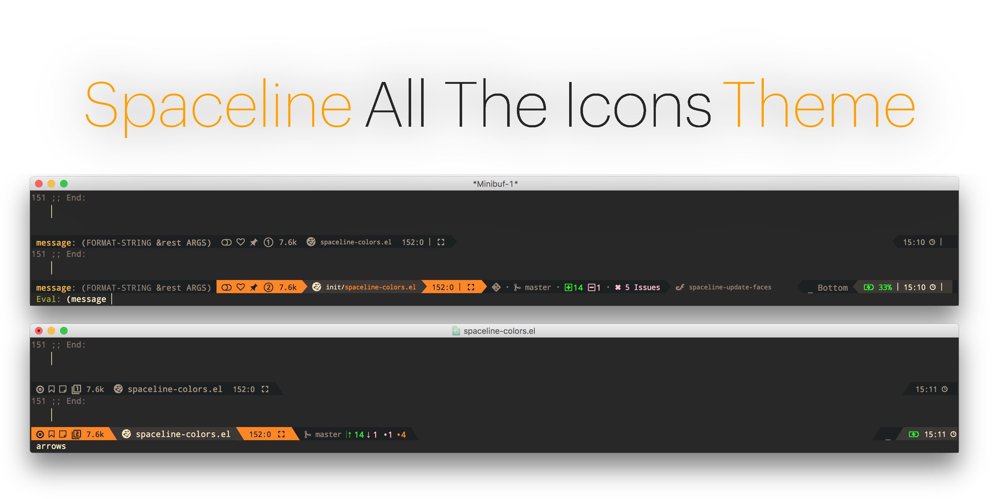

[](https://melpa.org/#/spaceline-all-the-icons)

<p align="center">

</p>


<p align="center">
<b><a href="#installation">Installation</a></b>
|
<b><a href="#usage">Usage</a></b>
|
<b><a href="#customization">Customization</a></b>
|
<b><a href="#debugging">Debugging</a></b>
</p>

## Installation

You should be able to install this package in the standard way, add it
to the load path and then calling

```el
(package-install 'spaceline-all-the-icons)

(require 'spaceline-all-the-icons)
;; or
(use-package spaceline-all-the-icons)
```

*N.B.* This package is *_highly_* dependent
on [`all-the-icons.el`](https://github.com/domtronn/all-the-icons.el), so make
sure you have the [fonts](https://github.com/domtronn/all-the-icons.el/tree/master/fonts)
installed correctly

## Usage

The simplest way to use this package is to set the `mode-line-format`
to be the `spaceline-all-the-icons` theme or by calling
`spaceline-all-the-icons-theme`

```el
(use-package spaceline-all-the-icons 
  :after spaceline
  :config (spaceline-all-the-icons-theme))
```

### Optional dependencies

There are a few segments that require optional packages and custom
setup functions in order to run.  Calling these two functions in your
setup/config will enable the segments.

```el
(spaceline-all-the-icons--setup-anzu)            ;; Enable anzu searching
(spaceline-all-the-icons--setup-package-updates) ;; Enable package update indicator
(spaceline-all-the-icons--setup-paradox)         ;; Enable Paradox mode line
(spaceline-all-the-icons--setup-neotree)         ;; Enable Neotree mode line
```

## Customization

The mode line is broken down into _segments_, where each segment can
be toggled on or off independently.

Also, some of the segments have _icon sets_ associated with them and
can be modified to your taste.

You can see all of these options by calling

```el
M-x customize-group spaceline-all-the-icons
```

### Disabled Segments

Some segments are _disabled by default_ you can turn them on by
calling the following in your `:config`

```el
(spaceline-toggle-all-the-icons-SEGMENT-on)
```

| Segment | Description |
| :-- | :-- |
| `bookmark` | Indicates whether the current file is [Bookmarked](https://emacswiki.org/emacs/BookMarks) |
| `dedicated` | Indicates whether the current file is dedicated |
| `fullscreen` | Indicates whether the frame is Fullscreen  |
| `buffer-position` | Indicates the position through the buffer as a percentage  |

### Icon Sets

The following segments can have their icon sets customized. You can
choose these by calling the following or setting it in `:config`

```el
M-x customize-group spaceline-all-the-icons-icon-set

(setq spaceline-all-the-icons-icon-set-modified 'toggle)
```

These segments can have one of the following icon sets

| Segment | Available Icons |
| :-- | :-- |
| `modified` | `chain`, `toggle`, `circle` |
| `bookmark` | `bookmark`, `heart`, `star` |
| `dedicated` | `pin`, `sticky-note` |
| `window-numbering` | `circle`, `solid`, `string`, `square` |
| `git-stats` | `diff-icons`, `arrows` |
| `flycheck-slim` | `solid`, `outline`, `dots` |
| `sun-time` | `rise/set`, `sun/moon`, `arrows` |

### Separators

You can customize the divider separators using
`spaceline-all-the-icons-separators-type`, the available types are:
`'slant`, `'arrow`, `'cup`, `'wave`, `'none`

### Debugging

When a segment throws an error in Spaceline, this causes the entire
mode line to disappear _(be blank)_, this is since the
`mode-line-format` throws an error. 

Spaceline unfortunately hides a lot of errors internally and doesn't
given you information as to which segment is throwing an error.

To debug this, try running 

```el
M-x spaceline-all-the-icons--debug-segments
C-u M-x spaceline-all-th-icons--debug-segments
```

This will return a list of segments which are throwing errors and will
help me to debug any issues you're having!

Calling it with a `C-u` prefix will _(should)_ disable the segments
that are currently erroring so that at least the mode line will work.

[▲ back to top](#readme)
